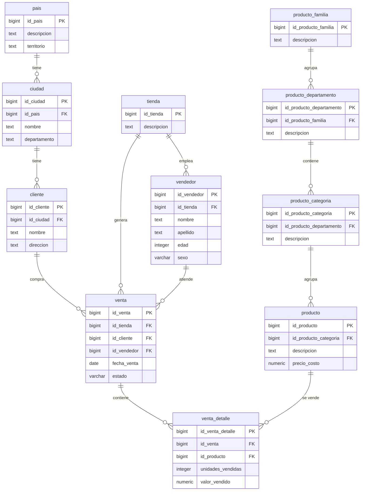
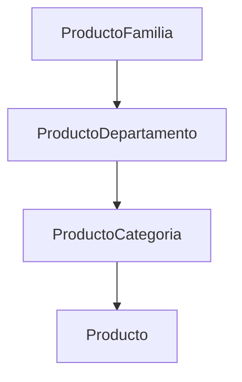

# Nexa Store — Diccionario de datos

Base de datos: `nexa_store_db` · Motor: PostgreSQL · Esquema: `public` · Actualizado: 2026-09-16

---

## 1. Resumen de tablas

| Tabla | Descripcion | Registros | PK | Tipo PK | FKs |
|-------|-------------|-----------|----|---------|-----|
| `pais` | Paises | 20 | `id_pais` | `bigint` | — |
| `producto_familia` | Familias de producto | 5 | `id_producto_familia` | `bigint` | — |
| `tienda` | Tiendas / sucursales | 10 | `id_tienda` | `bigint` | — |
| `ciudad` | Ciudades | 75 | `id_ciudad` | `bigint` | 1 → pais |
| `producto_departamento` | Departamentos de producto | 4 | `id_producto_departamento` | `bigint` | 1 → producto_familia |
| `vendedor` | Vendedores | 25 | `id_vendedor` | `bigint` | 1 → tienda |
| `cliente` | Clientes | 92 | `id_cliente` | `bigint` | 1 → ciudad |
| `producto_categoria` | Categorias de producto | 7 | `id_producto_categoria` | `bigint` | 1 → producto_departamento |
| `producto` | Productos | 109 | `id_producto` | `bigint` | 1 → producto_categoria |
| `venta` | Ventas | 252 750 | `id_venta` | `bigint` | 3 → tienda, cliente, vendedor |
| `venta_detalle` | Detalle de ventas | 311 964 | `id_venta_detalle` | `bigint` | 2 → venta, producto |

> Todas las PKs y FKs son `bigint`. Cada tabla tiene su propia secuencia PostgreSQL para generación automática de ids.

### Secuencias

| Secuencia | Tabla | Valor actual (MAX) |
|-----------|-------|--------------------|
| `pais_id_seq` | pais | 20 |
| `producto_familia_id_seq` | producto_familia | 4 |
| `tienda_id_seq` | tienda | 10 |
| `ciudad_id_seq` | ciudad | 75 |
| `producto_departamento_id_seq` | producto_departamento | 4 |
| `vendedor_id_seq` | vendedor | 25 |
| `cliente_id_seq` | cliente | 193 |
| `producto_categoria_id_seq` | producto_categoria | 7 |
| `producto_id_seq` | producto | 109 |
| `venta_id_seq` | venta | 1 254 993 |
| `venta_detalle_id_seq` | venta_detalle | 3 534 992 |

---

## 2. Diagrama de relaciones

### Jerarquia de producto

---

## 3. Diccionario de columnas por tabla

### 3.1 pais

| Columna | Tipo SQL | Nulo | PK | Descripcion |
|---------|----------|------|----|-------------|
| `id_pais` | `bigint` | NO | Si | Identificador unico (secuencia: `pais_id_seq`) |
| `descripcion` | `text` | Si | — | Nombre del pais |
| `territorio` | `text` | Si | — | Territorio o region |

Constraint PK: `pais_pkey` · Indices: `idx_pais_lookup` (id_pais, descripcion, territorio)

---

### 3.2 producto_familia

| Columna | Tipo SQL | Nulo | PK | Descripcion |
|---------|----------|------|----|-------------|
| `id_producto_familia` | `bigint` | NO | Si | Identificador unico (secuencia: `producto_familia_id_seq`) |
| `descripcion` | `text` | Si | — | Nombre de la familia |

Constraint PK: `producto_familia_pkey` · Indices: `idx_producto_familia_lookup` (id, descripcion)

---

### 3.3 tienda

| Columna | Tipo SQL | Nulo | PK | Descripcion |
|---------|----------|------|----|-------------|
| `id_tienda` | `bigint` | NO | Si | Identificador unico (secuencia: `tienda_id_seq`) |
| `descripcion` | `text` | Si | — | Nombre de la tienda |

Constraint PK: `tienda_pkey` · Indices: `idx_tienda_lookup` (id, descripcion)

---

### 3.4 ciudad

| Columna | Tipo SQL | Nulo | PK | FK | Descripcion |
|---------|----------|------|----|----|-------------|
| `id_ciudad` | `bigint` | NO | Si | — | Identificador unico (secuencia: `ciudad_id_seq`) |
| `nombre` | `text` | Si | — | — | Nombre de la ciudad |
| `departamento` | `text` | Si | — | — | Departamento / provincia |
| `id_pais` | `bigint` | Si | — | `pais.id_pais` | Pais al que pertenece |

Constraint PK: `ciudad_pkey` · FK: `pais_fk` → pais(id_pais)
Indices: `idx_ciudad_lookup` (id, nombre, departamento, id_pais)

---

### 3.5 producto_departamento

| Columna | Tipo SQL | Nulo | PK | FK | Descripcion |
|---------|----------|------|----|----|-------------|
| `id_producto_departamento` | `bigint` | NO | Si | — | Identificador unico (secuencia: `producto_departamento_id_seq`) |
| `id_producto_familia` | `bigint` | Si | — | `producto_familia.id_producto_familia` | Familia padre |
| `descripcion` | `text` | Si | — | — | Nombre del departamento |

Constraint PK: `producto_departamento_pkey` · FK: `familia_fk` → producto_familia(id_producto_familia)
Indices: `idx_producto_departamento_lookup` (id, id_familia, descripcion)

---

### 3.6 vendedor

| Columna | Tipo SQL | Nulo | PK | FK | Descripcion |
|---------|----------|------|----|----|-------------|
| `id_vendedor` | `bigint` | NO | Si | — | Identificador unico (secuencia: `vendedor_id_seq`) |
| `nombre` | `varchar(80)` | NO | — | — | Nombre del vendedor |
| `apellido` | `varchar(80)` | NO | — | — | Apellido del vendedor |
| `edad` | `integer` | NO | — | — | Edad |
| `id_tienda` | `bigint` | NO | — | `tienda.id_tienda` | Tienda asignada |
| `sexo` | `varchar` | Si | — | — | Sexo |

Constraint PK: `vendedor_pkey` · FK: `tienda_fk` → tienda(id_tienda) **NOT NULL**

---

### 3.7 cliente

| Columna | Tipo SQL | Nulo | PK | FK | Descripcion |
|---------|----------|------|----|----|-------------|
| `id_cliente` | `bigint` | NO | Si | — | Identificador unico (secuencia: `cliente_id_seq`) |
| `id_ciudad` | `bigint` | Si | — | `ciudad.id_ciudad` | Ciudad de residencia |
| `nombre` | `text` | Si | — | — | Nombre del cliente |
| `direccion` | `text` | Si | — | — | Direccion |

Constraint PK: `cliente_pkey` · FK: `ciudad_fk` → ciudad(id_ciudad)
Indices: `idx_cliente_lookup` (id, id_ciudad, nombre, direccion)

---

### 3.8 producto_categoria

| Columna | Tipo SQL | Nulo | PK | FK | Descripcion |
|---------|----------|------|----|----|-------------|
| `id_producto_categoria` | `bigint` | NO | Si | — | Identificador unico (secuencia: `producto_categoria_id_seq`) |
| `descripcion` | `text` | Si | — | — | Nombre de la categoria |
| `id_producto_departamento` | `bigint` | Si | — | `producto_departamento.id_producto_departamento` | Departamento padre |

Constraint PK: `producto_categoria_pkey` · FK: `departamento_fk` → producto_departamento(id_producto_departamento)

---

### 3.9 producto

| Columna | Tipo SQL | Nulo | PK | FK | Descripcion |
|---------|----------|------|----|----|-------------|
| `id_producto` | `bigint` | NO | Si | — | Identificador unico (secuencia: `producto_id_seq`) |
| `descripcion` | `text` | Si | — | — | Nombre del producto |
| `id_producto_categoria` | `bigint` | Si | — | `producto_categoria.id_producto_categoria` | Categoria padre |
| `precio_costo` | `numeric(15,2)` | Si | — | — | Precio de costo |

Constraint PK: `producto_pkey` · FK: `producto_cat_fk` → producto_categoria(id_producto_categoria)
Indices: `idx_producto_lookup` (id, descripcion, id_categoria)

---

### 3.10 venta

| Columna | Tipo SQL | Nulo | PK | FK | Descripcion |
|---------|----------|------|----|----|-------------|
| `id_venta` | `bigint` | NO | Si | — | Identificador unico (secuencia: `venta_id_seq`) |
| `id_tienda` | `bigint` | NO | — | `tienda.id_tienda` | Tienda de la venta |
| `id_cliente` | `bigint` | NO | — | `cliente.id_cliente` | Cliente comprador |
| `id_vendedor` | `bigint` | NO | — | `vendedor.id_vendedor` | Vendedor |
| `fecha_venta` | `date` | NO | — | — | Fecha de la venta |
| `estado` | `varchar` | Si | — | — | Estado: Completada, Cancelada |

Constraint PK: `venta_pkey`
FKs: `tienda_fk` → tienda(id_tienda), `cliente_fk` → cliente(id_cliente), `vendedor_fk` → vendedor(id_vendedor) — **todas NOT NULL**
Indices: `idx_venta_lookup` (id_venta)

---

### 3.11 venta_detalle

| Columna | Tipo SQL | Nulo | PK | FK | Descripcion |
|---------|----------|------|----|----|-------------|
| `id_venta_detalle` | `bigint` | NO | Si | — | Identificador unico (secuencia: `venta_detalle_id_seq`) |
| `id_venta` | `bigint` | Si | — | `venta.id_venta` | Venta padre (CASCADE delete) |
| `id_producto` | `bigint` | Si | — | `producto.id_producto` | Producto vendido (CASCADE delete) |
| `unidades_vendidas` | `integer` | Si | — | — | Cantidad de unidades |
| `valor_vendido` | `numeric(18,2)` | Si | — | — | Valor total vendido |

Constraint PK: `venta_detalle_pkey`
FKs: `venta_fk` → venta(id_venta) **ON UPDATE CASCADE ON DELETE CASCADE**, `producto_fk` → producto(id_producto) **ON UPDATE CASCADE ON DELETE CASCADE**
Indices: `idx_venta_detalle_lookup` (id_venta_detalle)

---

## 4. Restricciones (constraints)

| Constraint | Tipo | Tabla | Columna | Referencia |
|------------|------|-------|---------|------------|
| `pais_pkey` | PRIMARY KEY | pais | id_pais | — |
| `producto_familia_pkey` | PRIMARY KEY | producto_familia | id_producto_familia | — |
| `tienda_pkey` | PRIMARY KEY | tienda | id_tienda | — |
| `ciudad_pkey` | PRIMARY KEY | ciudad | id_ciudad | — |
| `pais_fk` | FOREIGN KEY | ciudad | id_pais | → pais(id_pais) |
| `producto_departamento_pkey` | PRIMARY KEY | producto_departamento | id_producto_departamento | — |
| `familia_fk` | FOREIGN KEY | producto_departamento | id_producto_familia | → producto_familia(id_producto_familia) |
| `vendedor_pkey` | PRIMARY KEY | vendedor | id_vendedor | — |
| `tienda_fk` | FOREIGN KEY | vendedor | id_tienda | → tienda(id_tienda) |
| `cliente_pkey` | PRIMARY KEY | cliente | id_cliente | — |
| `ciudad_fk` | FOREIGN KEY | cliente | id_ciudad | → ciudad(id_ciudad) |
| `producto_categoria_pkey` | PRIMARY KEY | producto_categoria | id_producto_categoria | — |
| `departamento_fk` | FOREIGN KEY | producto_categoria | id_producto_departamento | → producto_departamento(id_producto_departamento) |
| `producto_pkey` | PRIMARY KEY | producto | id_producto | — |
| `producto_cat_fk` | FOREIGN KEY | producto | id_producto_categoria | → producto_categoria(id_producto_categoria) |
| `venta_pkey` | PRIMARY KEY | venta | id_venta | — |
| `tienda_fk` | FOREIGN KEY | venta | id_tienda | → tienda(id_tienda) |
| `cliente_fk` | FOREIGN KEY | venta | id_cliente | → cliente(id_cliente) |
| `vendedor_fk` | FOREIGN KEY | venta | id_vendedor | → vendedor(id_vendedor) |
| `venta_detalle_pkey` | PRIMARY KEY | venta_detalle | id_venta_detalle | — |
| `venta_fk` | FOREIGN KEY | venta_detalle | id_venta | → venta(id_venta) **ON UPDATE CASCADE ON DELETE CASCADE** |
| `producto_fk` | FOREIGN KEY | venta_detalle | id_producto | → producto(id_producto) **ON UPDATE CASCADE ON DELETE CASCADE** |

---

## 5. Indices

| Indice | Tabla | Columnas | Tipo |
|--------|-------|----------|------|
| `pais_pkey` | pais | id_pais | UNIQUE B-tree |
| `idx_pais_lookup` | pais | id_pais, descripcion, territorio | B-tree |
| `producto_familia_pkey` | producto_familia | id_producto_familia | UNIQUE B-tree |
| `idx_producto_familia_lookup` | producto_familia | id_producto_familia, descripcion | B-tree |
| `tienda_pkey` | tienda | id_tienda | UNIQUE B-tree |
| `idx_tienda_lookup` | tienda | id_tienda, descripcion | B-tree |
| `ciudad_pkey` | ciudad | id_ciudad | UNIQUE B-tree |
| `idx_ciudad_lookup` | ciudad | id_ciudad, nombre, departamento, id_pais | B-tree |
| `producto_departamento_pkey` | producto_departamento | id_producto_departamento | UNIQUE B-tree |
| `idx_producto_departamento_lookup` | producto_departamento | id_producto_departamento, id_producto_familia, descripcion | B-tree |
| `vendedor_pkey` | vendedor | id_vendedor | UNIQUE B-tree |
| `cliente_pkey` | cliente | id_cliente | UNIQUE B-tree |
| `idx_cliente_lookup` | cliente | id_cliente, id_ciudad, nombre, direccion | B-tree |
| `producto_categoria_pkey` | producto_categoria | id_producto_categoria | UNIQUE B-tree |
| `producto_pkey` | producto | id_producto | UNIQUE B-tree |
| `idx_producto_lookup` | producto | id_producto, descripcion, id_producto_categoria | B-tree |
| `venta_pkey` | venta | id_venta | UNIQUE B-tree |
| `idx_venta_lookup` | venta | id_venta | B-tree |
| `venta_detalle_pkey` | venta_detalle | id_venta_detalle | UNIQUE B-tree |
| `idx_venta_detalle_lookup` | venta_detalle | id_venta_detalle | B-tree |

---

## 6. Nota sobre tipos de PK

Todas las tablas usan `bigint` como tipo de PK y FK. Cada tabla tiene una secuencia PostgreSQL ownear que genera los ids automáticamente (`nextval`). La generación de ids está gestionada por JPA (`@GeneratedValue(strategy = SEQUENCE)`) en la capa Java.

Las FKs de `venta_detalle` (`id_venta`, `id_producto`) tienen `ON UPDATE CASCADE ON DELETE CASCADE`, lo que significa que si se elimina una venta o un producto, sus detalles se eliminan en cascada.
